# Implementation-of-Logistic-Regression-Using-Gradient-Descent

## AIM:
To write a program to implement the the Logistic Regression Using Gradient Descent.

## Equipments Required:
1. Hardware – PCs
2. Anaconda – Python 3.7 Installation / Jupyter notebook

## Algorithm
1. import pandas module and import the required data set.
2. Find the null values and count them. Count number of left values.
3. From sklearn import LabelEncoder to convert string values to numerical values.
4. From sklearn.model_selection import train_test_split.
5. Assign the train dataset and test dataset. From sklearn.tree import DecisionTreeClassifier. Use criteria as entropy.
6. From sklearn import metrics. Find the accuracy of our model and predict the require values.

## Program:
```
/*
Program to implement the the Logistic Regression Using Gradient Descent.
Developed by: JAYASREE R
RegisterNumber: 212223230087
import pandas as pd 
import numpy as np 
import matplotlib.pyplot as plt
from sklearn.model_selection import train_test_split from sklearn.preprocessing import LabelEncoder 
from sklearn.linear_model import LogisticRegression
df=pd.read_csv("/content/Placement_Data_Full_Class(1).csv")
df
df.drop('sl_no', axis=1)
df["gender"]=df["gender"].astype('category')
df["ssc_b"]=df["ssc_b"].astype('category')
df["hsc_b"]=df["hsc_b"].astype('category')
df["hsc_s"]=df["hsc_s"].astype('category')
df["degree_t"]=df["degree_t"].astype('category')
df ["workex"]=df["workex"].astype('category')
df["specialisation"]=df["specialisation"].astype('category')
df["status"]=df["status"].astype('category')
df["gender"]=df["gender"].cat.codes
df["ssc_b"]=df["ssc_b"].cat.codes
df["hsc_b"]=df["hsc_b"].cat.codes
df["hsc_s"]=df["hsc_s"].cat.codes
df["degree_t"]=df["degree_t"].cat.codes
df["workex"]=df["workex"].cat.codes
df ["specialisation"]=df["specialisation"].cat.codes
df["status"]=df["status"].cat.codes 
x=df.iloc[:,:-1].values
y=df.iloc[:,-1].values
X
y
theta-np.random.randn(x.shape[1])
y=y
def sigmoid(z): return 1/(1+np.exp(-z))
def loss (theta,x,y): h=sigmoid(x.dot(theta)) return -np.sum(y*np.log(h)+(1-y)*np.log(1-h))
def gradient_descent (theta, x, y, alpha, num_iterations):
m=len(y) for i in range(num_iterations): h=sigmoid(x.dot(theta)) gradient=x.T.dot(h-y)/m theta alpha gradient
return theta
theta-gradient_descent (theta,x,y, alpha=0.01, num_iterations=1000)
def predict(theta,x):
h=sigmoid(x.dot(theta))
y_pred-np.where(h >= 0.5,1,0) return y_pred
y_pred-predict(theta,x)
accuracy-np.mean(y_pred.flatten() == y) print("Accuracy:", accuracy)
xnew=np.array([[0,87,0,95,0,2,78,2,0,0,1,0,0]])
y_prednew=predict(theta, xnew)
print(y_prednew)
*/
```

## Output:

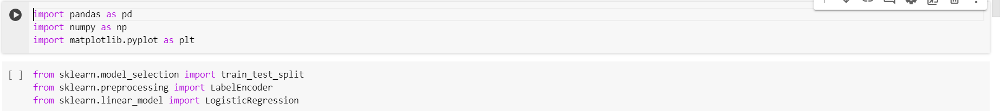
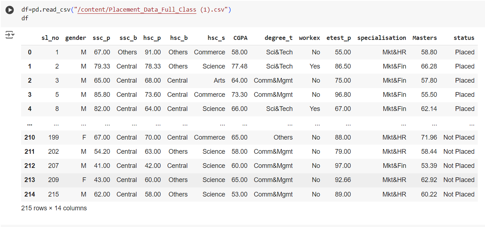
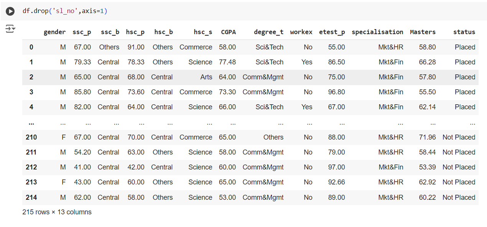
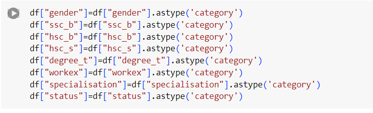
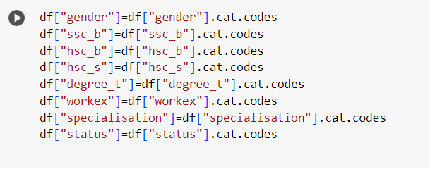
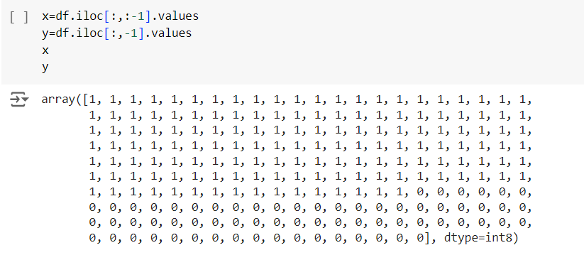
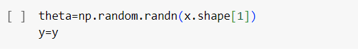

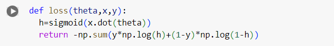
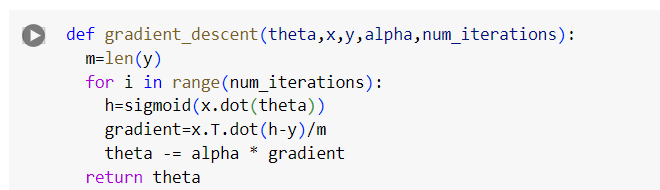

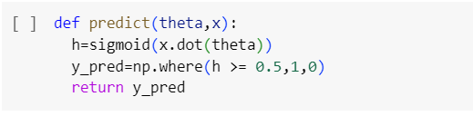

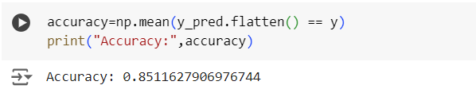
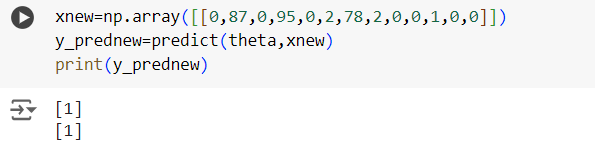
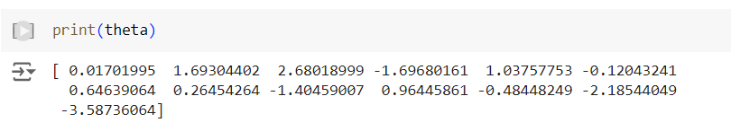
## Result:
Thus the program to implement the the Logistic Regression Using Gradient Descent is written and verified using python programming.

